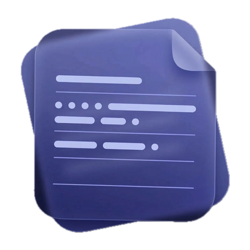

<!-- LOGO -->
<h1>
<p align="center">
  
  <br>Notty
</h1>
  <p align="center">
    A minimal, fast menu bar notepad for macOS.
    <br />
    <a href="#about">About</a>
    ·
    <a href="#install">Install</a>
    ·
    <a href="#cli">CLI</a>
    ·
    <a href="#features">Features</a>
    ·
    <a href="#build-from-source">Build</a>
  </p>
</p>

## About

Notty is a lightweight notepad that lives in your macOS menu bar.
Click the icon, type your thoughts, close it. Your notes are always
there, always saved, always one click away.

No Dock icon. No window management. No bloat. Just a fast, dark,
floating panel with a monospace editor that stays out of your way
until you need it.

It also comes with a CLI — add notes straight from your terminal
with `nt` or `notty`.

Built with pure Swift and AppKit — no Xcode, no SwiftUI, no dependencies.
Compiled with a single `make` command.

## Install

### Homebrew

```sh
brew tap NovationLabs/notty
brew install notty
```

This installs both the menu bar app and the `nt` / `notty` CLI commands.

### Build from source

```sh
git clone https://github.com/NovationLabs/Notty.git
cd Notty
make
make run
```

To install the CLI commands globally:

```sh
make install
```

Requirements: macOS + Xcode Command Line Tools (`xcode-select --install`).

## CLI

Both `nt` and `notty` are aliases to the same binary. Use whichever you prefer.

```sh
nt hello world              # Add a note
nt list                     # Display all notes
nt clear                    # Clear all notes (with confirmation)
nt                          # Launch the menu bar app
nt help                     # Show help
```

Notes added via CLI are instantly visible in the menu bar panel.

## Features

|  #  | Feature                          | Status |
| :-: | -------------------------------- | :----: |
|  1  | Menu bar icon (folder/folder.fill) |   ✅   |
|  2  | Dark floating panel              |   ✅   |
|  3  | Monospace text editor            |   ✅   |
|  4  | Auto-save to `~/.notty.txt`      |   ✅   |
|  5  | Corner resize                    |   ✅   |
|  6  | Works over fullscreen apps       |   ✅   |
|  7  | Visible on all Spaces            |   ✅   |
|  8  | CLI (`nt` / `notty`)             |   ✅   |
|  9  | Global shortcut `⌘+Control+N`   |   ✅   |
|  10 | Multiple notes / tabs            |   ❌   |
|  11 | Markdown preview                 |   ❌   |

## How it works

Notty runs as a macOS accessory app (`LSUIElement`) — no Dock icon, no
Cmd+Tab entry. It places a small folder icon in the menu bar. Click it
to open a floating panel, click anywhere else to close it. The icon
switches to `folder.fill` when the panel is open.

Press `⌘+Control+N` from anywhere to instantly open or close the panel,
without touching the mouse.

Notes are persisted to `~/.notty.txt` on every keystroke. There is no
save button. There is no file picker. It just works.

The same binary handles both GUI and CLI — if you pass arguments, it
runs in terminal mode. No arguments launches the menu bar app.

## Stack

- **Language**: Swift
- **Framework**: AppKit (Cocoa)
- **Build**: `swiftc` via Makefile
- **Dependencies**: None
- **Font**: Space Mono (fallback: system monospace)

---

<sub>Thanks to <a href="https://github.com/saihgupr">@saihgupr</a> for DMG Packaging 😁</sub>
